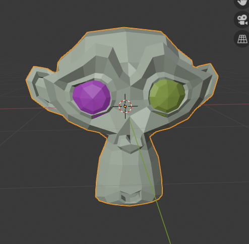

# Spectral-Clustering-mesh-segmentation

Implementation of the paper: Rong Liu and Hao Zhang, "Segmentation of 3D meshes through spectral clustering" in Blender 

# Example
If we select three clusters and use the monkey 'Suzanne' in Blender, the algorithm correctly identifies the base mesh and the two eyes as 3 different clusters. In some sense, it succesfully identifies the three important components of the mesh.

  

# TODOs
1. Refactor code
1. Loose components and test useful applicaton in "mesh destruction"